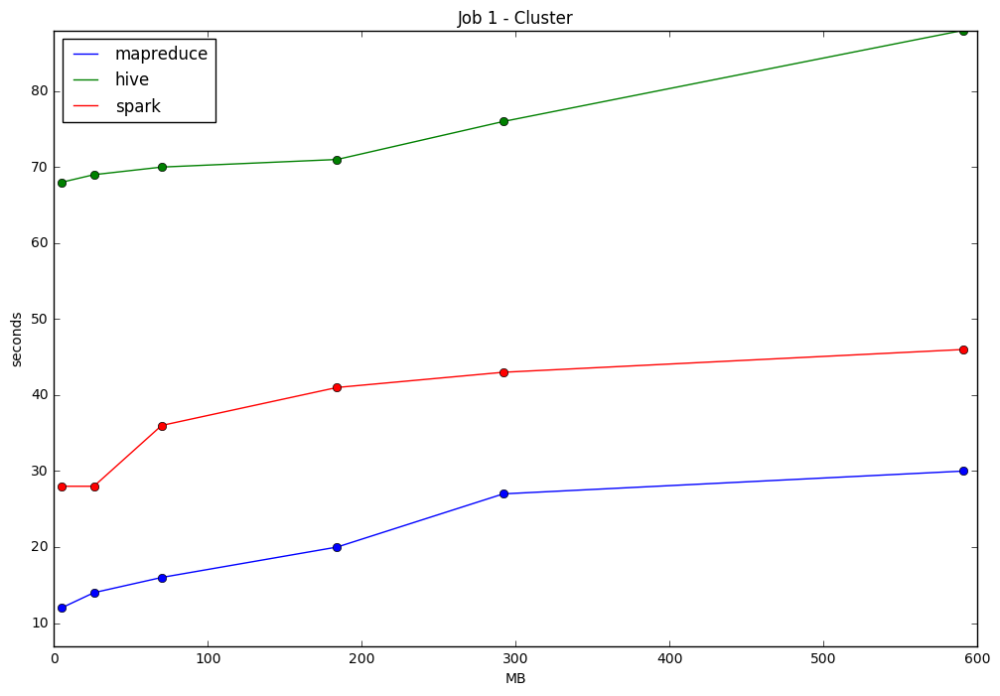

# Rapporto Finale
Gruppo MielPops - Gaetano Bonofiglio, Veronica Iovinella
## Job 1
### Pseudocodifica
### Map-Reduce
```javascript
Map(key, record):
    newKey = month + year + prodID
    emit (newKey, score)
```
```javascript
create global OrderedMap<year+month, (avg, prodId)> results

Reduce(key, records):
    create Array[5] top5
    month, year, prodId = key.getData()
    foreach score in records:
        totalScore += score
        totalCount++
    avg = totalScore / totalCount
    newKey = month + year
    value = (avg, prodId)
    top5.insertInOrderByAvg(value)
    results.insert(newKey, top5)
CleanUp():
    foreach newKey, value in results
        emit (newKey, value)
```

### Hive
```sql
SELECT mpl.month, COLLECT_LIST(mpl.product_id), COLLECT_LIST(mpl.avg_score) 
FROM
(   SELECT mp.month, mp.product_id, mp.avg_score, row_number() OVER (PARTITION BY mp.month ORDER BY mp.avg_score DESC) AS top_position 
    FROM
  (   SELECT FROM_UNIXTIME(time,'yyyyMM') AS month, product_id, AVG(score) AS avg_score
    FROM 1999_2006 
    GROUP BY FROM_UNIXTIME(time,'yyyyMM'), product_id 
    ORDER BY month ASC ) mp
  ORDER BY mp.avg_score DESC) mpl
WHERE mpl.top_position <= 5
GROUP BY mpl.month;
```

### Spark
```javascript
results = csv
        .mapToPair(month + product, (score, 1))
        .reduceByKey((scoreA + scoreB, countA + countB))
        .mapToPair(month, average)
        .groupByKey(1 node)
        .mapToPair(iterable.getTop5()).sortByKey(true)
```

### Output (prime 10 righe)
##### input 1999_2006.csv:
```
1999	10	(0006641040, 5.0)	
1999	12	(B00004CI84, 5.0)	(B00004CXX9, 5.0)	(B00004RYGX, 5.0)	
2000	01	(B00002N8SM, 5.0)	(B00004CXX9, 3.6666667)	(B00004CI84, 3.0)	(B00004RYGX, 3.0)	
2000	02	(B00004CI84, 4.0)	(B00004CXX9, 4.0)	(B00004RYGX, 4.0)	
2000	06	(B00002Z754, 5.0)	(B00004CI84, 5.0)	(B00004CXX9, 5.0)	(B00004RYGX, 5.0)	
2000	07	(B00004RAMX, 5.0)	
2000	08	(B00004CI84, 5.0)	(B00004CXX9, 5.0)	(B00004RYGX, 5.0)	(B00004S1C5, 5.0)	(B00004S1C6, 5.0)	
2000	10	(B00004CI84, 5.0)	(B00004CXX9, 5.0)	(B00004RYGX, 5.0)	
2000	12	(B00004CI84, 5.0)	(B00004CXX9, 5.0)	(B00004RYGX, 5.0)	(B00004S1C5, 5.0)	
2001	02	(B00004S1C6, 5.0)
```
        
## Job 2
### Pseudocodifica
### Map-Reduce
```javascript
Map(key, record):
    value = (score, prodId)
    emit (userID, value)
```
```javascript
create global OrderedMap<userId, (score, prodId)> results
Reduce(key, records):
    create Array[10] top10
    for each value in records:
        top10.insertInOrderByScore(value)
    results.insert(key, top10)
CleanUp():
    for each key, value in results
        emit (key, value)
```
### Hive
```sql
SELECT ups.user_id, COLLECT_LIST(ups.product_id), COLLECT_LIST(ups.score) 
FROM
(   SELECT user_id, product_id, score, row_number() OVER (PARTITION BY user_id ORDER BY score DESC) AS top_position 
    FROM 1999_2006 
  ORDER BY score DESC) ups
WHERE ups.top_position <= 10
GROUP BY ups.user_id
ORDER BY ups.user_id ASC;
```
### Spark
```javascript
results = csv
        .mapToPair(userId, (score, productId))
        .groupByKey(1 node)
        .mapToPair(iterable.getTop10()).sortByKey(true)
```

### Output (prime 10 righe)
##### input 1999_2006.csv:
```
A100CY9WRC18I2	(B000CQG84Y, 1)	
A101CCC619GN4S	(B00017L1UK, 5)	
A101VS17YZ5ZEJ	(B0004LW990, 5)	
A103OZ75AVET1Y	(B000CBOR60, 5)	
A1048CYU0OV4O8	(B00004RYGX, 5)	(B00004CI84, 5)	(B00004CXX9, 5)	
A105981PIJDJUU	(B000FFLHSY, 4)	
A106E0DP6X12NW	(B0007NOWMM, 1)	(B0001ES9F8, 1)	
A106MCEFKHCTX9	(B000DZFMEQ, 5)	
A106X6HMD3NE76	(B0002QEKPI, 5)	
A107OAJUDTZXTC	(B000FDMLUO, 5)	(B0007SNZQ6, 5)	(B000CROPGQ, 2)	
```

## Job 3
### Pseudocodifica
Di seguito proponiamo due versione di Map-Reduce, la prima costruita con due task map-reduce, la seconda con un solo task map-reduce ma RAM intensive
### 2x MapReduces version
```javascript
Map(key, record):
    if score >= 4:
        emit (prodId, userId)
Reduce(key, record):
    for i=0; i<values.length; i++:
        user1 = values[i]
             for j=i+1; j<values.length; j++: 
                user2 = values[j]
      if user1 != user2:
        newKey = orderCouple(user1, user2)
        emit (newKey, prodId) //prodId is the old key
Map2(key, record):
    newKey = (user1, user2)
    emit (newKey, prodId)
Reduce2(key, records):
    if records.length >= 3
        emit (key, records.toString())
```
### 1x MapReduce, RAM intensive
```javascript
Map(key, record):
    if score >= 4:
        emit (prodId, userId)

create global OrderedMap<coppia di utenti, lista di prodotti> results

Reduce(key, records):
    for i=0; i<values.length; i++:
        user1 = values[i]
             for j=i+1; j<values.length; j++:
      if user1 != user2:
        user2 = values[j]
        results.insert(value.userId + value2.userId, prodId)
CleanUp():
    for each key, value in results
        if value.lenght >= 3
        emit (key, value)
```
### Hive
```sql
SELECT upn.user_couple, upn.products
FROM
(	SELECT up.user_couple, COLLECT_LIST(up.product_id) as products, COUNT(1) as num_products
  FROM 
  (	SELECT DISTINCT CONCAT_WS(',', SORT_ARRAY(ARRAY(jr.user_id, jl.user_id))) as user_couple, jr.product_id
    FROM 1999_2006 jr JOIN 1999_2006 jl ON jr.product_id = jl.product_id AND jr.score >= 4 AND jl.score >=4 
    WHERE jr.user_id != jl.user_id 
    ) up
  GROUP BY up.user_couple 
  ORDER BY up.user_couple ASC
) upn
WHERE upn.num_products >= 3;
```
### Spark
```javascript
userScoreByProduct = csv
        .mapToPair(productId, (userId, score))
        .filter(score >= 4)
        
results = userScoreByProduct
        .join(userScoreByProduct on productId)
        .filter(user1 != user2)
        .mapToPair(orderCouple(user1, user2), productId)
        .distinct(1 node)
        .groupByKey(1 node)
        .filter(productList >= 3).sortByKey(true)
```
### Output (prime 10 righe)
##### input 1999_2006.csv:
```
A1048CYU0OV4O8	A157XTSMJH9XA4	[B00004CI84, B00004CXX9, B00004RYGX]
A1048CYU0OV4O8	A19JYLHD94K94D	[B00004CI84, B00004CXX9, B00004RYGX]
A1048CYU0OV4O8	A1BZEGSNBB7DVS	[B00004CI84, B00004CXX9, B00004RYGX]
A1048CYU0OV4O8	A1CAA94EOP0J2S	[B00004CI84, B00004CXX9, B00004RYGX]
A1048CYU0OV4O8	A1CZICCYP2M5PX	[B00004CI84, B00004CXX9, B00004RYGX]
A1048CYU0OV4O8	A1DU58OZJNPUHV	[B00004CI84, B00004CXX9, B00004RYGX]
A1048CYU0OV4O8	A1E5AVR7QJN8HF	[B00004CI84, B00004CXX9, B00004RYGX]
A1048CYU0OV4O8	A1FJOY14X3MUHE	[B00004CI84, B00004CXX9, B00004RYGX]
A1048CYU0OV4O8	A1GB1Q193DNFGR	[B00004CI84, B00004CXX9, B00004RYGX]
A1048CYU0OV4O8	A1HWMNSQF14MP8	[B00004CI84, B00004CXX9, B00004RYGX]
```
## Tempistiche
Tutti i test locali sono stati eseguiti su un container docker a cui sono stati dedicati 8 GB di memoria e 4 core @ 2.4 GHz, mentre i test sul cluster sono stati effettuati su cluster.inf.uniroma3.it.

I tempi di esecuzione su Spark sono stati calcolati partendo dal secondo in cui il nodo ha accettato il task, fino al completamento.

I tempi di esecuzione di Hive e Map-Reduce sono stati calcolati dal secondo di inizio della prima Map, fino al completamento.

Oltre ai dataset proposti, sono state eseguiti test su due dataset più grandi, il primo ottenuto dall'unione di tutti i dataset, il secondo duplicando il primo. Abbiamo ottenuto quindi un dataset da circa 300 MB e un dataset da circa 600 MB con molte ripetizioni.

### Job 1



Nei grafici di confronto di Hive e Spark è riportata una terza linea che rappresenta l'andamento su cluster escludendo il tempo di overhead.


### Job 2

L'andamento di Hive è caratterizzato dal fatto che nel 5° esperimento (sul dataset da circa 300 MB) il numero di Map allocate è minore e per questo risulta un tempo di overhead minore. È riportata dunque anche una proiezione dell'andamento (linea tratteggiata) escludendo l'outlier.


Nel grafico di confronto di Hive è riportata una terza linea che rappresenta l'andamento su cluster escludendo il tempo di overhead.


### Job 3
Poiché sono state scritte due algoritmi di Map-Reduce per il job 3, di seguito sono riportati gli esperimenti per entrambi gli algoritmi. Per quanto riguarda l'algoritmo RAM intensive, si precisa che sui dataset più grandi (da 300 MB in su) il job falliva sia in locale che su cluster per mancanza di memoria. MapReduce v1 (first), (second) e total sono tempi relativi al primo algoritmo Map-Reduce, mentre MapReduce v2 al secondo. 


